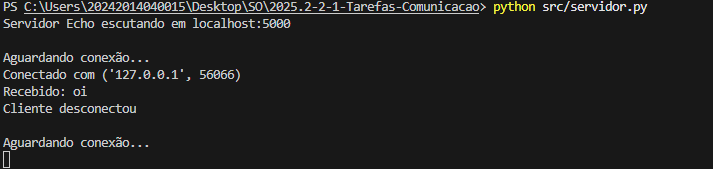
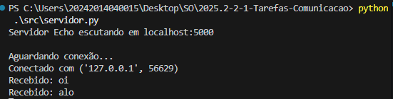
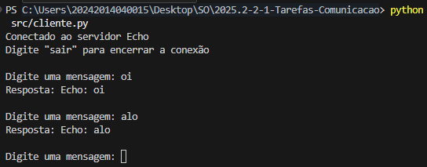
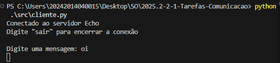
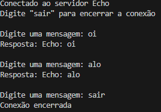

# Relato da atividade de comunicação entre processo usando sockets

## Informações gerais
- **disciplina**: Sistemas operacionais
- **semestre letivo**: 2025.2
- **aluno**: João Gabriel Silva Gama

## Parte 1 — 1 servidor e 1 cliente (bloqueante)
O cliente se conectou com sucesso ao Servidor Echo em localhost:5000. O cliente enviou a mensagem "oi", a qual foi recebida pelo servidor, ecoada de volta, e exibida no lado do cliente como "Resposta: Echo: oi". Em seguida, o cliente enviou o comando de encerramento "sair", e ambos, cliente e servidor, registraram o término limpo da conexão. O servidor então voltou a aguardar por uma nova conexão, mantendo-se estável.

#### Terminal do servidor

---
#### Terminal do cliente

---
## Parte 2 — 1 servidor e 2 clientes (bloqueante)
A observação dos terminais do servidor e dos dois clientes revelou que a aplicação implementa um Servidor Echo de modelo estritamente serial (bloqueante), que só consegue atender e processar o tráfego de um cliente por vez.

1. Interação do Cliente 1 e Bloqueio
O Servidor Echo iniciou com sucesso em localhost:5000.

O Cliente 1 se conectou, enviou duas mensagens ("oi" e "alo") e recebeu as respostas Echo correspondentes, realizando uma troca de serviço completa.

Enquanto o Cliente 1 estava conectado, o Cliente 2 também se conectou e enviou uma mensagem ("oi"), mas seu terminal bloqueou sem receber resposta. O servidor continuou focado no Cliente 1 e não processou o request do segundo cliente.

2. Evidência de Atendimento Serial
O bloqueio do Cliente 2, mesmo após se conectar e enviar dados, comprovou que o servidor opera em modo serial: ele ficou "preso" (bloqueado) no atendimento do primeiro cliente, impedindo o processamento de qualquer outro cliente que estivesse na fila.

3. Conclusão do Serviço e Desbloqueio
A situação só se resolveu quando o Cliente 1 se desconectou (enviando sair).

A desconexão do Cliente 1 liberou o servidor, permitindo que ele finalmente processasse a mensagem "oi" que estava pendente do Cliente 2.

#### Terminal do servidor

---
#### Terminal do Cliente 1 antes de encerrar a conexão

---
#### Terminal do Cliente 2 na fila para se conectar

---
#### Terminal do Cliente 1 após encerrar a conexão

---
#### Terminal do Cliente 2 após estabelecer conexão

---

## Parte 3 — Modificar o servidor para múltiplos clientes
FIXME seu relato

## Parte 4 — 1 servidor (concorrente) e 2 clientes
FIXME seu relato

